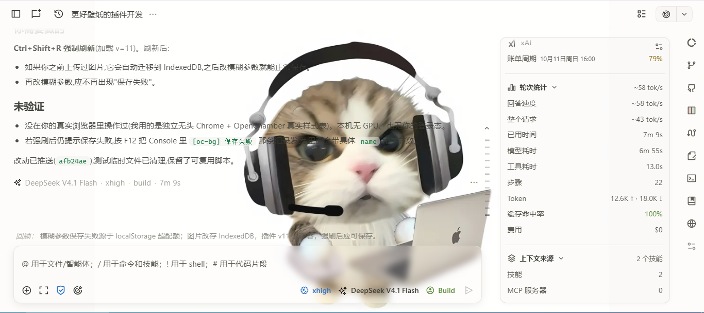

# openchamber-oc-bg

为 **OpenChamber Web** 添加自定义背景壁纸（图片 / 视频）与毛玻璃面板的前端插件。

单文件、零依赖、无构建步骤：一段 vanilla JS 直接注入样式、操作 DOM，并把设置项挂进 OpenChamber 的「外观」设置页。

> 参考项目：[HaoyueQin/deepseek-harness-background](https://github.com/HaoyueQin/deepseek-harness-background)（MIT）。本插件借用了它的技术思路：固定壁纸层 + 遮罩层、按属性开关、覆盖/复用设计 token、`backdrop-filter` 毛玻璃。实现是为 OpenChamber 的 token 体系重写的，不是对原项目的直接移植。

## 预览



壁纸铺在整页背景，卡片、弹层、输入区等面板做半透明 + 毛玻璃，主题色仍由 OpenChamber 管理。

## 平台与适用范围

| 项目 | 说明 |
| --- | --- |
| 目标平台 | **OpenChamber Web**，即 `@openchamber/web` 提供的网页界面 |
| 依赖 | OpenChamber Web（本机验证于 `@openchamber/web` 2.1.1，运行在 OpenCode 2.0.24 之上） |
| 运行位置 | 浏览器（本机验证于桌面版 Chrome / Edge） |
| 生效范围 | **只影响它被安装到的那一个 `@openchamber/web` 实例**。改的是该实例的 `dist` 目录 |
| 明确不适用 | OpenChamber 官方「扩展（Extensions）」机制；VS Code 扩展；手机 App；OpenCode 服务端插件。这些都不是本插件的形态 |
| 未验证 | 桌面应用内嵌的 Web UI、VS Code、手机端。它们的界面来自各自的打包副本，不一定是这个 `dist` |

一句话：**这是给自建 / 本机 OpenChamber Web 用的界面补丁，不是官方扩展，也不是跨端的通用插件。**

## 功能

- **自定义壁纸**：上传本地图片，或粘贴图片链接；内置一张默认壁纸。
- **视频背景**：本地或链接的 MP4 / WebM。播放时自动关掉壁纸模糊和毛玻璃采样，避免每帧重绘拖慢聊天滚动；切到后台或系统开启「减少动态效果」时暂停。本地视频存在 IndexedDB，不进 `localStorage`。
- **无后缀链接也能识别**：「自动」模式先看后缀，没有后缀时用 `HEAD` 读响应的 `Content-Type` 判断是图片还是视频。
- **防盗链兼容**：部分站点会拒绝带来源页的视频请求（返回 403）。直连失败时，会改用不带来源的受限请求（上限 32MB）读成本地 blob 再播放，不经过任何代理。站点不允许跨站读取时，会提示改用本地文件。
- **壁纸层 + 遮罩层**：壁纸固定在 `z-index:-2`，遮罩在 `z-index:-1`；遮罩自动跟随明暗主题（浅色用白纱，深色用黑纱）。
- **毛玻璃面板**：对卡片、弹层、输入区等面板做半透明 + `backdrop-filter` 模糊。**侧边栏除外**：它在收起时动画 `width`，对宽度动画中的元素加 `backdrop-filter` 会让浏览器每帧重新采样背景，造成收起卡顿；OpenChamber 本身也有 glass 系统，侧边栏只保留半透明填充。
- **实时调节**：壁纸不透明度、遮罩强度、面板不透明度、毛玻璃模糊、壁纸模糊、填充方式（铺满 / 完整显示）。
- **设置持久化**：写入浏览器 `localStorage`（键 `ocbg.settings.v2`），只存短引用；本地图片和视频存在 IndexedDB。旧版把本地图片存成 Data URL 放在 `localStorage`，会撑爆约 5MB 的配额导致保存失败，新版启动时会自动把它迁移到 IndexedDB。
- **中文字形兜底**：自托管 Noto Sans SC 变量字体，给没有 CJK 字体的设备补字形。
- **不覆盖主题**：只读取宿主的设计 token（`--surface-background`、`--card`、`--popover` 等），颜色仍由 OpenChamber 自己管理。

## 目录结构

```
oc-bg/
├── oc-bg.js                     # 插件本体（唯一源码文件）
├── wallpaper.webp               # 默认壁纸（本地预设）
├── docs/screenshot.png          # README 预览截图
└── fonts/noto-sans-sc/          # 自托管 Noto Sans SC 变量字体（OFL-1.1，含 LICENSE）
    ├── index.css
    └── files/*.woff2
```

## 安装

### 1. 找到要安装到的 `dist` 目录

安装目标是 `@openchamber/web` 的 `dist` 目录。它通常在全局 npm 目录下：

```
<全局 node_modules>/@openchamber/web/dist
```

查法：

```bash
npm root -g        # 全局 node_modules 路径，再拼 /@openchamber/web/dist
```

本机实例的路径是：

```
/home/ai/.local/lib/node_modules/@openchamber/web/dist
```

### 2. 复制文件

```
<dist>/oc-bg.js                      # 来自本仓库 oc-bg.js
<dist>/oc-bg-wallpaper.webp          # 来自本仓库 wallpaper.webp
<dist>/oc-bg-fonts/noto-sans-sc/...  # 来自本仓库 fonts/noto-sans-sc/
```

### 3. 在 `index.html` 里加两行

编辑 `<dist>/index.html`：

```html
<!-- 放在 </head> 前 -->
<link rel="stylesheet" href="/oc-bg-fonts/noto-sans-sc/index.css">

<!-- 放在 </body> 前 -->
<script src="/oc-bg.js?v=8"></script>
```

### 4. 刷新页面

`?v=8` 是缓存版本号。改代码后把它递增（`v=9`、`v=10`……）即可让浏览器重新拉取；必要时再用 Ctrl+Shift+R 强制刷新。

> 注意：这是直接改动 `@openchamber/web` 的 `dist`。升级 OpenChamber 会覆盖 `dist`，需要重新安装一次。

## 安装后在哪里设置

1. 打开 OpenChamber Web 页面。
2. 进入 **设置 → 外观**（英文界面为 **Settings → Appearance**）。
3. 页面向下找标题为 **「背景与毛玻璃」** 的区块。它出现在 **「会话活动」** 那一项的上方。

如果没看到这个区块：确认脚本已加载（页面按 `?v=` 重新加载过），且宿主仍保留锚点 `[data-settings-item="appearance.session-activity"]`。宿主改版去掉该锚点后，区块会挂不上，需要同步调整 `oc-bg.js`。

### 区块里的控件

| 控件 | 含义 |
| --- | --- |
| 启用背景 | 总开关 |
| 类型 | 自动 / 图片 / 视频。自动按后缀判断，无后缀时读响应类型 |
| 本地图片或视频 | 文件选择器可选所有图片和视频（含 `.mp4` `.webm` `.mov` `.mkv` 等）；能否播放取决于浏览器编码支持，推荐 H.264 MP4 / WebM。图片和视频都存 IndexedDB（`localStorage` 只留一个短引用），超过 32MB 会拒绝 |
| 壁纸链接 | 粘贴可直接访问的图片或视频 URL |
| 壁纸不透明度 | `0–100%`，壁纸整体透明度 |
| 遮罩 | `0–95%`，壁纸之上的可读性遮罩 |
| 面板不透明度 | `5–100%`，面板表面透明度；`≥98%` 时关闭毛玻璃 |
| 毛玻璃模糊 | `0–40px`，面板 `backdrop-filter` 模糊半径（侧边栏不受影响） |
| 壁纸模糊 | `0–60px`，壁纸自身的模糊 |
| 壁纸填充 | `cover`（铺满）/ `contain`（完整显示） |
| 清除背景 | 关闭背景并恢复原始外观 |

设置按浏览器保存，换浏览器或清空站点数据后会回到默认。

## 工作原理

- 用 `MutationObserver` 监听 DOM，把设置区块插到「外观」页的 `[data-settings-item="appearance.session-activity"]` 之前。
- 设置写入 `localStorage`，启动时读取并做范围钳制。
- 背景通过 `<html>` 上的 `data-ocbg` / `data-ocbg-glass` / `data-ocbg-playing` 属性开关，具体样式由注入的 `<style id="ocbg-style">` 提供。
- 面板半透明用 `color-mix(in srgb, var(--token) var(--ocbg-panel-opacity), transparent)`，只在 `.bg-card`、`.bg-popover`、`.bg-sidebar` 等面板类上生效；毛玻璃滤镜只加在真正的面板上，避免给每个按钮都上滤镜。侧边栏 `aside.bg-sidebar` 被显式排除在 `backdrop-filter` 之外（它在收起时动画 `width`）。
- 视频播放时置 `data-ocbg-playing`，临时关掉壁纸 `filter` 与面板 `backdrop-filter`，把合成放回浏览器默认路径，避免每帧重绘。
- 图片经 `Image()` 预加载校验；视频直连失败时按上文的兼容路径重试。

## 兼容性与已验证环境

- 面向 OpenChamber Web（`@openchamber/web`）。
- 依赖的锚点 `appearance.session-activity` 与 token 名称属于宿主实现，宿主改版后可能需要同步调整。
- 已验证：`@openchamber/web` 2.1.1 + 桌面 Chrome / Edge。设置区块挂在「外观」页「会话活动」上方。
- 未验证：桌面应用内嵌 UI、VS Code、手机端。

## 致谢 / 第三方资源

- 技术思路参考 [HaoyueQin/deepseek-harness-background](https://github.com/HaoyueQin/deepseek-harness-background)（MIT License）。
- 字体：Noto Sans SC，SIL Open Font License 1.1，见 `fonts/noto-sans-sc/LICENSE`。
- 内置默认壁纸 `wallpaper.webp` 仅作演示用途，版权归原始来源所有。

## License

MIT，见 [LICENSE](./LICENSE)。